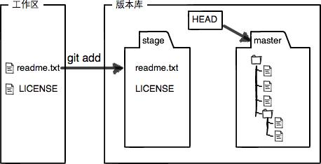
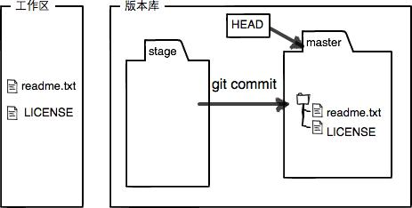
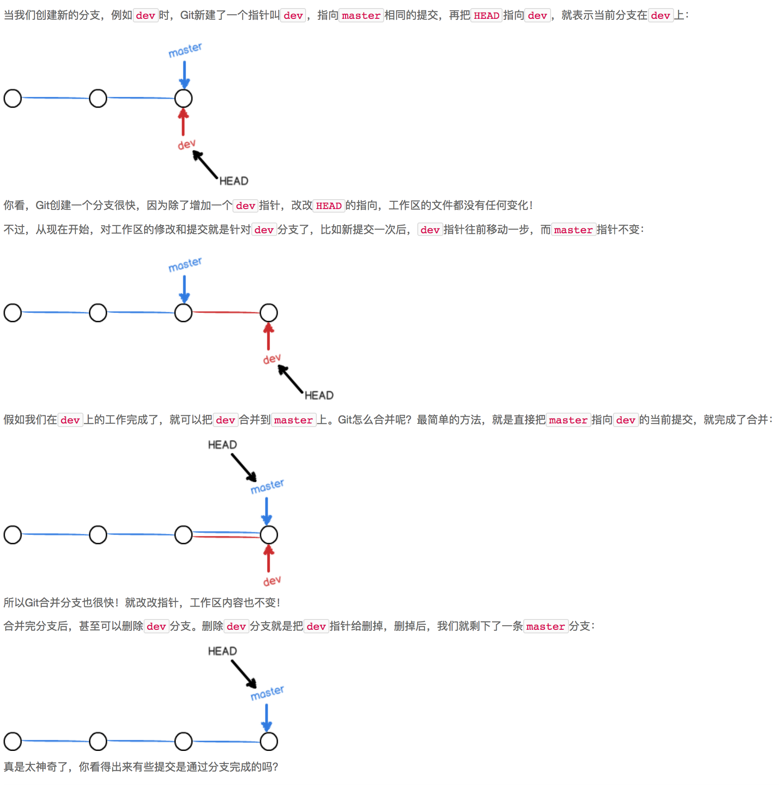
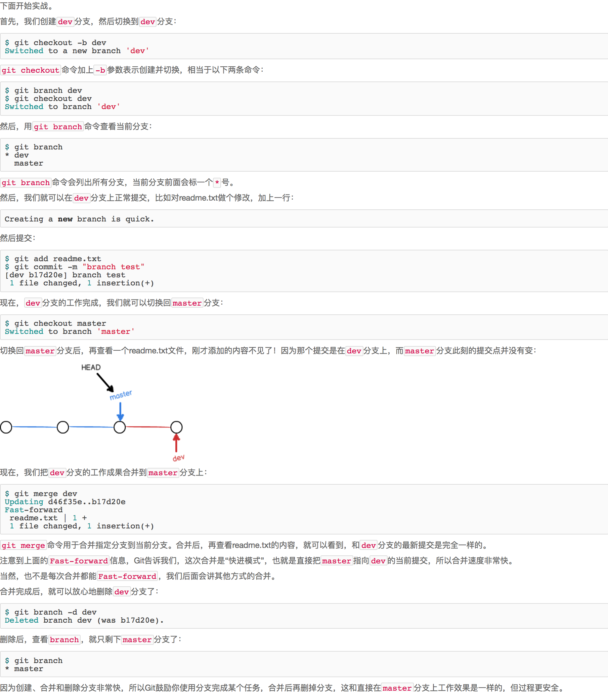

## Git学习总结

### Git仓库初始化和提交
    初始化一个Git仓库，使用git init命令。

    添加文件到Git仓库，分两步：

    使用命令git add <file>，注意，可反复多次使用，添加多个文件；
    使用命令git commit -m <message>，完成。
    
### 版本回退
    git log:显示从最近到最远的提交日志
    如果嫌输出信息太多，看得眼花缭乱的，可以试试加上--pretty=oneline参数,git log --pretty=oneline

    首先，Git必须知道当前版本是哪个版本，在Git中，用HEAD表示当前版本，上一个版本就是HEAD^，上上一个版本就是HEAD^^，当然往上100个版本写100个^比较容易数不过来，所以写成HEAD~100
    使用 git reset --hard HEAD^ 回退到上个版本

    如果回退到了上个版本，那么问题来了，现在要怎么回到现在呢？好比你从21世纪坐时光穿梭机来到了19世纪，想再回去已经回不去了，肿么办？
    办法其实还是有的，只要上面的命令行窗口还没有被关掉，你就可以顺着往上找啊找啊，找到那个版本的commit id
    使用：git reset --hard 1094a，其中1094a是commit id

    现在，你回退到了某个版本，关掉了电脑，第二天早上就后悔了，想恢复到新版本怎么办？找不到新版本的commit id怎么办？
    Git提供了一个命令git reflog用来记录你的每一次命令

    总结：
    HEAD指向的版本就是当前版本，因此，Git允许我们在版本的历史之间穿梭，使用命令git reset --hard commit_id。
    穿梭前，用git log可以查看提交历史，以便确定要回退到哪个版本。
    要重返未来，用git reflog查看命令历史，以便确定要回到未来的哪个版本


### 工作区和暂存区


    Git和其他版本控制系统如SVN的一个不同之处就是有暂存区的概念.

    第一步是用git add把文件添加进去，实际上就是把文件修改添加到暂存区；
    第二步是用git commit提交更改，实际上就是把暂存区的所有内容提交到当前分支。
    因为我们创建Git版本库时，Git自动为我们创建了唯一一个master分支，所以，现在，git commit就是往master分支上提交更改。
    你可以简单理解为，需要提交的文件修改通通放到暂存区，然后，一次性提交暂存区的所有修改




    所以，git add命令实际上就是把要提交的所有修改放到暂存区（Stage），然后，执行git commit就可以一次性把暂存区的所有修改提交到分支。



### 管理修改

    Git管理的是修改
    比如你新增了一行，这就是一个修改，删除了一行，也是一个修改，更改了某些字符，也是一个修改，删了一些又加了一些，也是一个修改，甚至创建一个新文件，也算一个修改。

    每次修改，如果不用git add到暂存区，那就不会加入到commit中


### 撤销修改

```js
 git checkout -- readme.txt
```

    命令git checkout -- readme.txt意思就是，把readme.txt文件在工作区的修改全部撤销，这里有两种情况：
    一种是readme.txt自修改后还没有被放到暂存区，现在，撤销修改就回到和版本库一模一样的状态；
    一种是readme.txt已经添加到暂存区后，又作了修改，现在，撤销修改就回到添加到暂存区后的状态。
    总之，就是让这个文件回到最近一次git commit或git add时的状态。

```
git checkout -- file命令中的--很重要，没有--，就变成了“切换到另一个分支”的命令，我们在后面的分支管理中会再次遇到git checkout命令。
```

```
现在假定是凌晨3点，你不但写了一些胡话，还git add到暂存区了
庆幸的是，在commit之前，你发现了这个问题。用git status查看一下，修改只是添加到了暂存区，还没有提交
Git同样告诉我们，用命令git reset HEAD <file>可以把暂存区的修改撤销掉（unstage），重新放回工作区
git reset命令既可以回退版本，也可以把暂存区的修改回退到工作区。当我们用HEAD时，表示最新的版本
```

```
场景1：当你改乱了工作区某个文件的内容，想直接丢弃工作区的修改时，用命令git checkout -- file。
场景2：当你不但改乱了工作区某个文件的内容，还添加到了暂存区时，想丢弃修改，分两步，第一步用命令git reset HEAD <file>，就回到了场景1，第二步按场景1操作。
场景3：已经提交了不合适的修改到版本库时，想要撤销本次提交，参考版本回退一节，不过前提是没有推送到远程库。
```

### 删除文件

````
在Git中，删除也是一个修改操作
````
先添加一个新文件test.txt到Git并且提交

```
$ git add test.txt

$ git commit -m "add test.txt"
[master b84166e] add test.txt
 1 file changed, 1 insertion(+)
 create mode 100644 test.txt
```
一般情况下，你通常直接在文件管理器中把没用的文件删了，或者用rm命令删了
```
$ rm test.txt
```
这个时候，Git知道你删除了文件，因此，工作区和版本库就不一致了，git status命令会立刻告诉你哪些文件被删除了
```
$ git status
On branch master
Changes not staged for commit:
  (use "git add/rm <file>..." to update what will be committed)
  (use "git checkout -- <file>..." to discard changes in working directory)

    deleted:    test.txt

no changes added to commit (use "git add" and/or "git commit -a")
```
现在你有两个选择，一是确实要从版本库中删除该文件，那就用命令git rm删掉，并且git commit
```
$ git rm test.txt
rm 'test.txt'

$ git commit -m "remove test.txt"
[master d46f35e] remove test.txt
 1 file changed, 1 deletion(-)
 delete mode 100644 test.txt
```
现在，文件就从版本库中被删除了

另一种情况是删错了，因为版本库里还有呢，所以可以很轻松地把误删的文件恢复到最新版本
```
$ git checkout -- test.txt
```
git checkout其实是用版本库里的版本替换工作区的版本，无论工作区是修改还是删除，都可以“一键还原”。

小结
```
命令git rm用于删除一个文件。如果一个文件已经被提交到版本库，那么你永远不用担心误删，但是要小心，你只能恢复文件到最新版本，你会丢失最近一次提交后你修改的内容。
```

### 添加远程库

#### 现在的情景是，你已经在本地创建了一个Git仓库后，又想在GitHub创建一个Git仓库，并且让这两个仓库进行远程同步，这样，GitHub上的仓库既可以作为备份，又可以让其他人通过该仓库来协作，真是一举多得。

首先，登陆GitHub，然后，在右上角找到“Create a new repo”按钮，创建一个新的仓库

把本地仓库的内容推送到GitHub仓库
```
$ git remote add origin git@github.com:<GitHub账户名>/learngit.git
例如: git remote add origin git@github.com:sunny586/learngit.git
```
```
同步github上的代码库时，如果使用SSH链接，而你的SSH key没有添加到github帐号设置中，系统会报错
解决办法：
需要在本地创建SSH key，然后将生成的SSH key文件内容添加到github帐号上去。
  首先利用本机安装的Git创建SSH key，执行如下命令就可以
  1. ssh-keygen -t rsa -C <your email>
  2. cat ~/.ssh/id_rsa.pub
```

把本地库的所有内容推送到远程库上
```
$ git push -u origin master
```
    由于远程库是空的，我们第一次推送master分支时，加上了-u参数，Git不但会把本地的master分支内容推送的远程新的master分支，还会把本地的master分支和远程的master分支关联起来，在以后的推送或者拉取时就可以简化命令。

    在推送内容到github仓库时，先git pull origin master 
    如果报错：fatal: refusing to merge unrelated histories
    这是因为在Github新建一个仓库，本地也写了一个仓库，他们是两个不同的项目;
    要把两个不同的项目合并，git需要添加一句代码：
    git pull origin master --allow-unrelated-histories
小结
```
要关联一个远程库，使用命令git remote add origin git@server-name:path/repo-name.git；
关联后，使用命令git push -u origin master第一次推送master分支的所有内容；
此后，每次本地提交后，只要有必要，就可以使用命令git push origin master推送最新修改；
分布式版本系统的最大好处之一是在本地工作完全不需要考虑远程库的存在，也就是有没有联网都可以正常工作，而SVN在没有联网的时候是拒绝干活的！当有网络的时候，再把本地提交推送一下就完成了同步，真是太方便了！
```
 ### 从远程库克隆

* 假设我们从零开发，那么最好的方式是先创建远程库，然后，从远程库克隆
* 下一步是用命令git clone克隆一个本地库
```
$ git clone git@github.com:michaelliao/gitskills.git
Cloning into 'gitskills'...
remote: Counting objects: 3, done.
remote: Total 3 (delta 0), reused 0 (delta 0), pack-reused 3
Receiving objects: 100% (3/3), done.
```
```
你也许还注意到，GitHub给出的地址不止一个，还可以用https://github.com/michaelliao/gitskills.git这样的地址。实际上，Git支持多种协议，默认的git://使用ssh，但也可以使用https等其他协议。

使用https除了速度慢以外，还有个最大的麻烦是每次推送都必须输入口令，但是在某些只开放http端口的公司内部就无法使用ssh协议而只能用https
```
小结
```
要克隆一个仓库，首先必须知道仓库的地址，然后使用git clone命令克隆。
Git支持多种协议，包括https，但通过ssh支持的原生git协议速度最快。
```

### 创建与合并分支

在版本回退里，你已经知道，每次提交，Git都把它们串成一条时间线，这条时间线就是一个分支。截止到目前，只有一条时间线，在Git里，这个分支叫主分支，即master分支。HEAD严格来说不是指向提交，而是指向master，master才是指向提交的，所以，HEAD指向的就是当前分支。

一开始的时候，master分支是一条线，Git用master指向最新的提交，再用HEAD指向master，就能确定当前分支，以及当前分支的提交点：


每次提交，master分支都会向前移动一步，这样，随着你不断提交，master分支的线也越来越长




小结
```
Git鼓励大量使用分支：
查看分支：git branch
创建分支：git branch <name>
切换分支：git checkout <name>
创建+切换分支：git checkout -b <name>
合并某分支到当前分支：git merge <name>
删除分支：git branch -d <name>
```
* 如果想要删除掉某个分支，并同步到远端请使用命令：
```
git push origin :<分支名称>
```