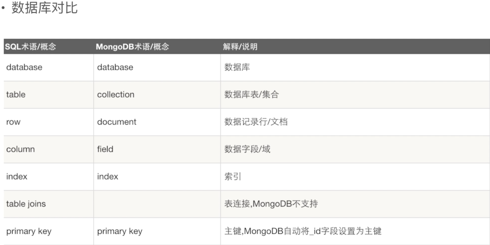

### MongoDB创建用户

 1.创建管理员
 ```s
 # 创建（切换到）admin数据库
 use admin
 # 创建一个帐号
 db.createUser({user:"admin",pwd:"admin",roles:["root"]})

 ```
 2.授权认证
 ```s
 # 对帐号进行认证
 db.auth("admin","admin")
 ```
 3.给使用的数据库添加用户
 ```s
# 创建（切换到）test数据库
 use test
 # 给test数据库创建一个用户
 db.createUser({user:"root",pwd:"123456",roles:[{role:"dbOwner",db:"test"}]})
 ```
4.通过--auth启动mongoDB
 ```s
 mongod -f /Users/zhangyu/server/mongo/etc/mongo.conf --auth
 ```

 ### MongoDB基本语法
 
 + 插入文档
 + 更新文档
 + 删除文档
 + 查询文档

```s
# 查看数据库
show dbs
# 创建数据库
use demo
# 创建一个集合（表）
db.createCollection("user")
# 创建一个集合（表），并插入一条数据
db.users.insert({id:123,name:"hello"})
# 删除一个集合
db.user.drop()
# 查看集合（表）
show conllections
# 删除数据库
db.dropDatabase()
# 查看数据库
db.user.find() # db.user.find().pretty() (格式化)
# 查询第一条数据
db.user.findOne()
# 更新一条数据
db.user.update({userName:"jack"},{$set:{userAge:30}})
# 更新一条子文档
db.user.update({userName:"jack"},{$set:{"class.name":'baidu-test'}})
# 查询文档
db.user.find({userName:'jack'})
# 查询子文档
db.user.find({'class.name':'baidu'})
# 查询年龄大于40的文档
db.user.find({userAge:{$gt:40}})
# 查询年龄小于40的文档
db.user.find({userAge:{$lt:40}})
# 查询年龄等于40的文档
db.user.find({userAge:{$eq:40}})
# 查询年龄大于等于40的文档
db.user.find({userAge:{$gte:40}})
# 删除一条文档
db.user.remove({userId:101})
```
### 表数据设计和插入

1.手动插入
```s
# 创建数据库db_demo
use db_demo
# 创建goods集合（表），并插入一条数据
db.goods.insert({"id":'1001',name:'zhangsan',address:'深圳'})
```
2.文件导入
```s
# 创建一个空集合
db.createCollection("users")
# 用客户端工具将数据文件导入即可
用mongohub客户端导入数据
```
3.用MongoDB终端进行导入
```s
# db_demo是数据库名称
# users是集合名称（表）
# /Users/zhangyu/Desktop/dumall-users.是要导入的文件的目录
mongoimport -d db_demo -c users --file /Users/zhangyu/Desktop/dumall-users.
```


