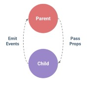
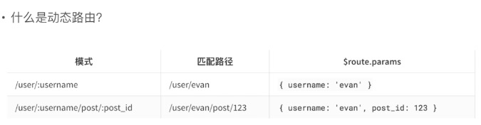

### 模板语法
  
* Mustache语法: {{msg}}
* Html赋值: v-html=""
* 绑定属性:v-bind:id=""
* 使用表达式: {{ok? 'YES':'NO'}}
* 文本赋值:v-text=""
* 指令:v-if=""
* 过滤器: {{message|capitalize}} & v-bind.id="rowId | formatId"

### Class和Style绑定
* 对象语法: v-bind:class="{active:isActive,'text-danger':hasError}"
* 数组语法: 
```html
<div v-bind:class="[a,b]"></div>
data:{
  a:'aClass',
  b:'bClass'
}
```
* style绑定－对象语法: v-bind:style="{color:activeColor,fontSize:fontSize+'px'}"

### 条件渲染
* v-if
* v-else
* v-else-if
* v-show
* v-cloak

### vue 事件处理事件


### Vue组件
* 全局组件和局部组件
* 父子组件通讯－数据传递
* Slot

    
* 子组件操作父组件数据。通过给父组件绑定自定义事件，子组件方法中使用this.$emit('自定义事件名')（此方法相当于jquery里面的trigger）来执行父组件的函数，从而改变父组件数据。
* 如果想要子组件传值给父组件，通过this.$emit('自定义事件名','想传的值'）传递给父组件，父组件的该自定义事件回调方法的入参，即为你想传递的值。

### 路由基础介绍

#### 什么是前端路由？
    路由是根据不同的url地址展示不同的内容和页面

    前端路由就是把不同路由对应不同的内容或页面的任务交给前端来做，之前是通过服务端根据url的不同返回不同的页面实现的
#### 什么时候使用前端路由？
    在单页面应用，大部分页面结构不变，只改变部分内容的时候使用
#### 前端路由有什么优点和缺点？
    优点：
        用户体验好，不需要每次从服务器全部获取，快速展现给用户
    缺点：
        不利于SEO
        使用浏览器的前进，后退的时候会重新发请求，没有合理地利用缓存
        单页面无法记录之前滚动的位置，无法在前进，后退的时候纪录滚动条的位置

 ```html     
<router-link> this.$router.push({path:""}) 等于A标签做跳转

<router-view> 跳转之后渲染的位置
```




