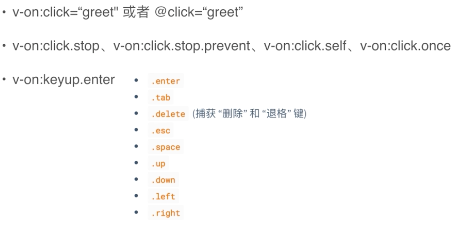

### 模板语法
  
* Mustache语法: {{msg}}
* Html赋值: v-html=""
* 绑定属性:v-bind:id=""
* 使用表达式: {{ok? 'YES':'NO'}}
* 文本赋值:v-text=""
* 指令:v-if=""
* 过滤器: {{message|capitalize}} & v-bind.id="rowId | formatId"

### Class和Style绑定
* 对象语法: v-bind:class="{active:isActive,'text-danger':hasError}"
* 数组语法: 
```html
<div v-bind:class="[a,b]"></div>
data:{
  a:'aClass',
  b:'bClass'
}
```
* style绑定－对象语法: v-bind:style="{color:activeColor,fontSize:fontSize+'px'}"

### 条件渲染
* v-if
* v-else
* v-else-if
* v-show
* v-cloak

### vue 事件处理事件

